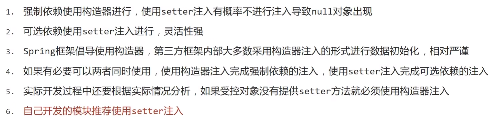
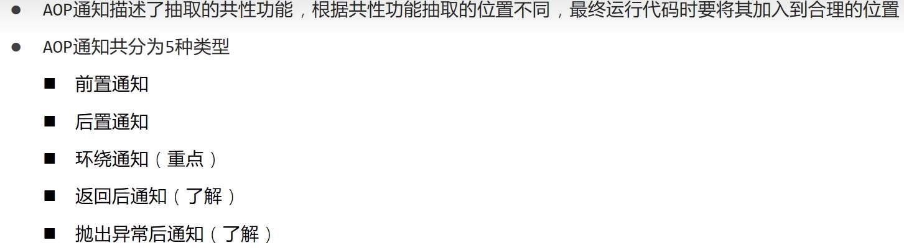
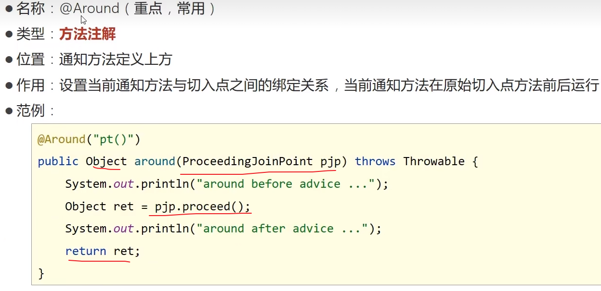
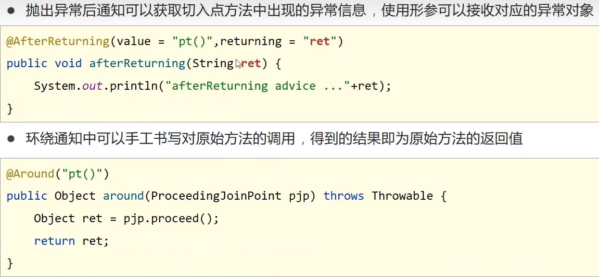
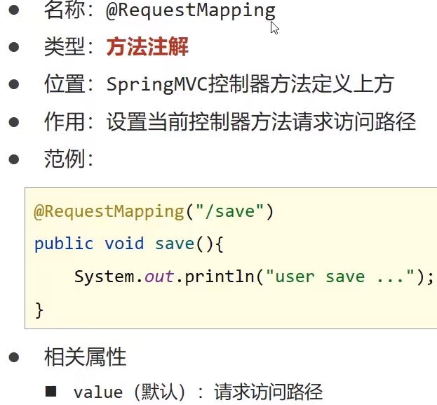

# 初识spring


------


# Spring Framework系统架构


## IOC控制反转


## DI


## IOC入门案例


## DI入门案例


**注意**：spring会自动调用该setter方法，所以需提供对应方法


### **注意**

​	property内name属性需与serive中dao的名字相同，ref需与bean容器的dao名字相同

### **小总结**

​	bean相当于生成对象的容器，在DI案例中当主程序生成bean中的bookServiceImpl对象时，由于与bookDao有绑定关系，会先生成一个bookDaoImpl对象，然后将其通过setter方法传入bookServiceImpl类中，所以当主程序调用Service的save方法时会调用到Dao的save方法

## bean基础配置


### **别名配置**


### bean的作用范围配置


**小理解**

​	bean默认造出的对象都是一个对象，即bean造出的所有引用的地址相同,都指向一个对象,scope配置可以修改默认行为。

**作用范围说明**


## 实例化bean的四种方式

### **1.构造方法（常用）**


### 2.静态工厂（了解）


**作用：**若需在工厂中有必要的配置，则有必要用该方式实例化

### 3.实例工厂（了解）


**知识：**先造工厂的实例再通过方法造想要的对象

### 4.FactoryBean方式（实用）

第3种方式的优化版


## bean生命周期


### **bean销毁时机**


## 依赖注入四种方式

### 1.setter注入--引用类型


### 2.setter注入--简单类型


### 3.构造器注入--引用类型


### 4.构造器注入--简单类型


### 构造器注入--参数适配（了解）


### 依赖注入方式选择



### 依赖自动装配


### 依赖自动装配特征


## 注入集合对象


## 第三方数据管理对象使用


## 加载properties文件


**加载properties文件时注意要项**


## 创建容器的方式


## 获取bean的方式


## 容器类层次结构图


## 小总结

### 1.容器相关


### 2.bean相关


### 3.依赖注入相关


## 注解开发定义bean


## 纯注解开发

纯注解开发不再需要ApplicationContext.properties文件形式，改用注解形式进行开发，但需创建一个SpringConfig类

```java
import org.springframework.context.annotation.ComponentScan;
import org.springframework.context.annotation.Configuration;

@Configuration
@ComponentScan("Dao")
//组件扫描路径
public class SpringConfig {
}
```

```java
public class test {
    public static void main(String[] args) {
        //ApplicationContext ctx=new ClassPathXmlApplicationContext("applicationContext.xml");
        //原先的ClassPathXmlApplicationContext方式获取容器改为
        //AnnotationConfigApplicationContext注解方式获取
        ApplicationContext ctx=new AnnotationConfigApplicationContext(SpringConfig.class);
        BookDao bookDao = ctx.getBean("bookDao", BookDao.class);
        bookDao.save();
    }
}
```


### 注解开发bean作用范围与生命周期管理


```java
//jdk8之后想使用@PostConstruct和@PreDestory需引入以下依赖
<dependency>
  <groupId>javax.annotation</groupId>
  <artifactId>javax.annotation-api</artifactId>
  <version>1.3.2</version>
</dependency>
```


### 依赖注入


### 加载properties文件


### 第三方bean管理


**一般不写在SpringConfig类中，使用独立的配置类管理第三方bean**

```java
//在Config包下新建一个jdbc配置类
public class jdbcConfig {
    @Bean
    public DataSource dataSource(){
        DruidDataSource ds=new DruidDataSource();
        ds.setDriverClassName("com.mysql.jdbc.Driver");
        ds.setUrl("jdbc:mysql://localhost:3306/hrdb");
        ds.setUsername("root");
        ds.setPassword("123456");
        return ds;
    }
}
```

**将独立的配置类加入核心配置**

##### 方式一：导入式(推荐)

```java
public class jdbcConfig {
    @Bean
    public DataSource dataSource(){
        DruidDataSource ds=new DruidDataSource();
        //相关配置
        return ds;
    }
}
```

**使用@Import注解手动加入配置类到核心配置，此注解只能添加一次，多个数据请用数组格式**

```java
@Configuration
@Import(jdbcConfig.class)
public class SpringConfig {

}
```

##### 方式二：扫描式

```java
@Configuration
public class jdbcConfig {
    @Bean
    public DataSource dataSource(){
        DruidDataSource ds=new DruidDataSource();
        //相关配置
        return ds;
    }
}
```

```java
@Configuration
@ComponentScan({"config","Dao","Service"})
public class SpringConfig {

}
```

### 第三方bean依赖注入

​	**简单类型的依赖注入**

```java
public class jdbcConfig {
    @Value("com.mysql.jdbc.Driver")
    //也可将文件写到jdbc.properties中,如
    //@Value("${driverName}")
    private String DriverName;
    @Value("jdbc:mysql://localhost:3306/hrdb")
    private String Url;
    @Value("root")
    private String Username;
    @Value("123456")
    private String Password;
    @Bean
    public DataSource dataSource(){
        DruidDataSource ds=new DruidDataSource();
        ds.setDriverClassName(DriverName);
        ds.setUrl(Url);
        ds.setUsername(Username);
        ds.setPassword(Password);
        return ds;
    }
}
```

​	**引用类型的依赖注入**


## Xml配置对比注解配置


## Spring整合MyBatis

**需要的包：**druid(造dataSource) mybaties(3.5.6) mysql-connection mybaties-spring(1.3.0) spring-jdbc spring-context

```java
public class MybatisConfig {
    @Bean
    public SqlSessionFactoryBean sqlSessionFactoryBean(DataSource dataSource){
        SqlSessionFactoryBean sfb=new 		SqlSessionFactoryBean();
        //设置实体类包的别名
        sfb.setTypeAliasesPackage("domain");
        sfb.setDataSource(dataSource);
        return sfb;
    }
    @Bean
    public MapperScannerConfigurer mapperScannerConfigurer(){
        MapperScannerConfigurer msc=new MapperScannerConfigurer();
        //设置mapper所在的包
        msc.setBasePackage("Dao");
        return msc;
    }

}
```


```java
@Configuration
@ComponentScan({"Dao","Service"})
@PropertySource("classpath:jdbc.properties")
@Import({MybatisConfig.class,jdbcConfig.class})

public class SpringConfig {

}
```

```java
public class jdbcConfig {
    @Value("${jdbc.DriverName}")
    private String DriverName;
    @Value("${jdbc.Url}")
    private String Url;
    @Value("${jdbc.Username}")
    private String Username;
    @Value("${jdbc.Password}")
    private String Password;
    @Bean
    public DataSource dataSource(){
        DruidDataSource ds=new DruidDataSource();
       ds.setDriverClassName(DriverName);
        ds.setUrl(Url);
        ds.setUsername(Username);
        ds.setPassword(Password);
        return ds;
    }
}
```

```java
//jdbc.properties
jdbc.DriverName=com.mysql.cj.jdbc.Driver
jdbc.Url=jdbc:mysql://localhost:3306/hrdb
jdbc.Username=root
jdbc.Password=123456
```

```java
public class test {
    public static void main(String[] args) throws IOException {
        AnnotationConfigApplicationContext ctx=new AnnotationConfigApplicationContext(SpringConfig.class);
        UserService userService = ctx.getBean(UserService.class);
        System.out.println(userService.selectALL());
    }
}
```

​	Spring整合mybaties,其中mybaties的datasource来自druid(jdbcConfig）,druid的相关配置写在外面的resources下的jdbc.properties文件中


## Spring整合Junit

**需要的包：**junit   spring-test


## Aop

### Aop简介


### 核心概念


### 入门案例思路分析


### 工作流程


### 核心概念


### 切入点表达式


### 表达式通配符


### Aop通知类型



##### 前置通知


##### 后置通知


##### 环绕通知




##### 正常执行通知


##### 异常通知


### 测量业务层接口万次执行效率


### 通知获取数据


##### 获取切入点方法的参数


##### 获取返回值数据



##### 获取异常数据（了解）


### 百度网盘密码数据兼容处理


## Spring事务

### 简介


### 银行账户转账案例


### 事物角色


### 事物相关配置


**注意：**有些事物遇到异常是会回滚的（error,部分异常），ioExpection等不回滚，所以需要设置rollbackFor

### 事物的传播行为


##### 转帐业务追加日志


## Postman插件工具


## SpringMVC

### 概述

Spring与Servlet技术等同，但更简洁


**注意：**Springmvc和Spring使用的是不同的容器

### 入门案例


**注意：**还需引入tomcat插件，且将servlet坐标的scope设置为provided，因为tomcat7也有servlet坐标


**启动tocat时需要加载Springmvc技术**





### 入门案例工作流程


### Controller加载控制与业务bean加载控制


### 请求

##### 请求映射路径


##### Get请求传参


##### Post请求传参


##### Post请求中文乱码处理


##### 请求传参5种类型

**1.普通参数（地址名与形参变量名相同**）


**2.普通参数（地址名与形参变量名不同**）


**3.POJO参数**


**4.嵌套POJO参数**


**5.数组参数**


**6.集合参数**


##### **@RequestParam注解**


##### 接收请求中的json数据


##### @EnableWebMvc注解


##### @RequestBody


##### @RequestBody与@RequestParam区别


##### 日期类型参数传递


##### 类型转换器


### 响应

##### 响应页面


##### 响应文本数据


##### 响应json数据


##### @ResponseBody注解


##### 类型转换器


### 注意：请求和响应json数据都需依赖json jar包